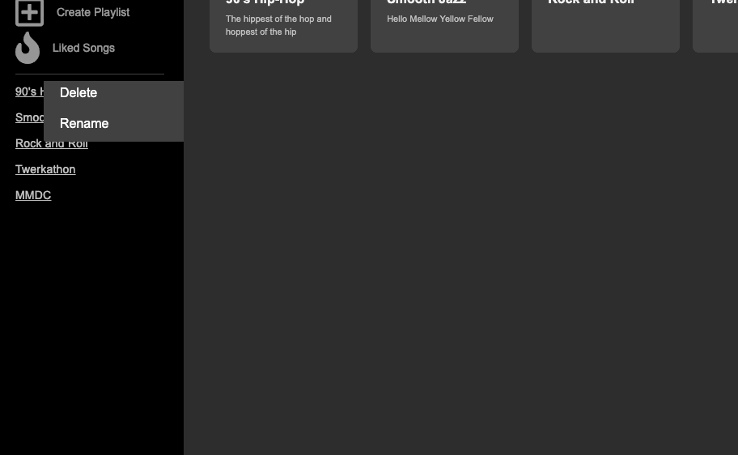

# Sosofly v.0.0.1 
#### Listening is Everything

* Created w/ ruby 2.5.1 by Isaac Owens 2020
---
### Sosofly is a web hosted music streaming app that allows you to listen to music, save and play playlists, and discover new music. Create powerful playlists and flex your genre muscle. You'll be feeling so, so fly and glad you did. (image here)

[Sosolfy.com](https://sosofly.herokuapp.com/#/)

--
## Tech Stack
Sosofly is an MVC framework app developed with ReactJS + PostgresSQL Database + Ruby on Rails API.
The audio mp3 file storage is handled by AWS S3.

## System dependencies
    "@babel/core": "^7.10.2",
    "@babel/preset-env": "^7.10.2",
    "@babel/preset-react": "^7.10.1",
    "@fortawesome/fontawesome-svg-core": "^1.2.28",
    "@fortawesome/free-regular-svg-icons": "^5.13.0",
    "@fortawesome/free-solid-svg-icons": "^5.13.0",
    "@fortawesome/react-fontawesome": "^0.1.9",
    "babel-loader": "^8.1.0",
    "bootstrap": "^4.5.0",
    "react": "^16.13.1",
    "react-bootstrap": "^1.0.1",
    "react-dom": "^16.13.1",
    "react-modular-audio-player": "^1.2.0",
    "react-redux": "^7.2.0",
    "react-router-dom": "^5.2.0",
    "redux": "^4.0.5",
    "redux-logger": "^3.0.6",
    "redux-thunk": "^2.3.0",
    "webpack": "^4.43.0",
    "webpack-cli": "^3.3.11"

## Run Sosofly
### Run the following code in sequence to get Sosofly up and running on your local machine
1. `bundle install` to install Rails gems
2. `webpack --mode=development --watch` or `npm run webpack` to package js files
3. `bundle exec rails db:create` to create database 
4. `bundle exec rails bd:seed` to seed database with a demo user, playists, and tracks (seed.rb)
5. `Run local server to view Sosofly in a browser window

## Features
Sosofly supports streaming of audio files along with creation of customized playlists.  From the Login page (login_form.jsx), use the Demo User button to start interacting with seeded data from the seed file)

## Audio Playback

Audio playback was implemented with a combination of basic <audio> html tags, and conditional callback statements.  Each Track Component maintains updating it's own local state and also relays information to the PlayBar component's (parent component) local state.  When a Track is clicked, the component will update it's local state key of 'nowPlaying' to true, and update the PlayBar component's local state key of 'nowPlaying' to the audio object queried from the document via it's title.  The object that is returned from the document query is then called with .play() which returns a promise, and upon success calls setState on it's local state key.  Within the play logic for each Track, a coniditional statement will have the Track determine if:
 
1. it is playing or paused in which case it toggles itself
 
2. there is another track playing in which case, it calls a function `stopAllSongs` that stops all tracks, resets their time, and begins to play

3. no track is playing in which case the songs begins to play

## Context Menu dropdown modal access

This section of the project was particularly tricky. On a right click on any given playlist listed as a link in the NavBar Component, a dropdown menu appears which gives you the option to either delete or rename a playlist.  If delete is chosen a modal form pops up asking for confirmation of the chosen playlist.  This at first seemed like a simple dropdown problem but I quickly realized how busy the logic and complications of this functionality truly are.  Firstly, the menu needs to be positioned against the link, which is a scrollable section, so intial attempts attempts for the menu caused it to pop up at the botton of the entire list.  Through some research I found that I can actually position the menu relative to the page position of the click event.  This was the key to getting the menu to stay close to the link.  

First, I created two portions of state for keeping track of both the x and y coordinate of the click on the page at the time of the event firing.  Then, within a styling object that I passed to the drop down menu container, I adjusted the x and y coordinates through the css `top:` and `left:` selectors from the local state by a fixed number of pixels.   

## Future Directions
  * Fully functional play bar
  * Artist and album show pages
  * Draggable components
  * Search functionality
